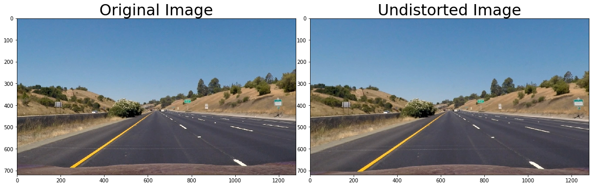

## Advanced Lane Finding Project

The goals / steps of this project are the following:

* Compute the camera calibration matrix and distortion coefficients given a set of chessboard images.
* Apply a distortion correction to raw images.
* Use color transforms, gradients, etc., to create a thresholded binary image.
* Apply a perspective transform to rectify binary image ("birds-eye view").
* Detect lane pixels and fit to find the lane boundary.
* Determine the curvature of the lane and vehicle position with respect to center.
* Warp the detected lane boundaries back onto the original image.
* Output visual display of the lane boundaries and numerical estimation of lane curvature and vehicle position.

---
## First, I'll compute the camera calibration using chessboard images

There are three image is white out, because it's unrecognizable.


# Use distortion coeffient and camera matrix to undistort image


```python
testImg_undistort = cv2.undistort(testImg, mtx, dist, None, mtx)
```



# birds-eye view:
### 1. use cv2.getPerspectiveTransform() to get M the transform matrix
### 2. use cv2.warpPerspective() to warp your image to a birds-eye view


```python
M = cv2.getPerspectiveTransform(src, dst)
warped = cv2.warpPerspective(img, M, (w,h), flags=cv2.INTER_LINEAR)
```


# color transforms
### Use cv2.cvtColor(testImg_unwarp, cv2.COLOR_RGB2HLS) covert image to HLS
### Had converted image to RGB form BGR before, so do COLOR_RGB2HLS


```python
testeImg_unwarp_HLS = cv2.cvtColor(testImg_unwarp, cv2.COLOR_RGB2HLS)
```


# Gradients

### Create a method abs_sobel_thresh() and use cv2.Sobel () to converted image to gradients
### cv2.Sobel () can choose orientation we want, use x orientation as default because lane line is reach y-axis


```python
def abs_sobel_thresh(img, orient='x', thresh_min=255, thresh_max=255):
    # Apply the following steps to img
    # 1) Convert to grayscale === or LAB L channel
    gray = (cv2.cvtColor(img, cv2.COLOR_RGB2GRAY))
    # 2) Take the derivative in x or y given orient = 'x' or 'y'
    sobel = cv2.Sobel(gray, cv2.CV_64F, orient=='x', orient=='y')
    # 3) Take the absolute value of the derivative or gradient
    abs_sobel = np.absolute(sobel)
    # 4) Scale to 8-bit (0 - 255) then convert to type = np.uint8
    scaled_sobel = np.uint8(255*abs_sobel/np.max(abs_sobel))
    # 5) Create a mask of 1's where the scaled gradient magnitude 
            # is > thresh_min and < thresh_max
    sxbinary = np.zeros_like(scaled_sobel)
    sxbinary[(scaled_sobel >= thresh_min) & (scaled_sobel <= thresh_max)] = 1
    # 6) Return this mask as your binary_output image
    binary_output = sxbinary
    return binary_output
```


I had use direction threshold but it's not good for lane detection so I give it up.
```python
testImg_sobelMag2 = mag_thresh(testImg_unwarp, 7, (10, 20))
tesImg_sobelDir2 = dir_thresh(testImg_unwarp, 7, (0.25, 0.65))
combined = np.zeros_like(testImg_sobelMag2)
combined[((testImg_sobelMag2 == 1) & (tesImg_sobelDir2 == 1))] = 1
# Visualize sobel magnitude + direction threshold
f, (ax1, ax2) = plt.subplots(1, 2, figsize=(20,10))
f.subplots_adjust(hspace = .2, wspace=.05)
ax1.imshow(testImg_unwarp)
ax1.set_title('Unwarped Image', fontsize=30)
ax2.imshow(combined, cmap='gray')
ax2.set_title('Sobel Magnitude + Direction', fontsize=30)
```


# Use color transforms and gradients to create a thresholded binary image.And wrap it as LaneDetectAdv()

```python
def LaneDetectAdv(img):
    # Undistort
    img_undistort = cv2.undistort(img, mtx, dist, None, mtx)
    
    # Perspective Transform
    img_unwarp, M, Minv = unwarp(img_undistort, src, dst)

    # Sobel Magnitude
    img_sobelMag = mag_thresh(img_unwarp, 7, (2, 80))
    
    # Sobel Absolute
    img_sobelAbs = abs_sobel_thresh(img_unwarp, 'x', 20, 65)
    
    # Sobel Direction
    img_sobelDir = dir_thresh(img_unwarp, 7, (0.25, 0.65))
    
    # HLS S-channel Threshold
    img_S_Thresh = hls_S_thresh(img_unwarp, (35, 255))
    
    # Combine HLS and sobel absolution
    combined = np.zeros_like(img_S_Thresh)
    combined[((img_sobelAbs==1) & (img_S_Thresh == 1))] = 1
    return combined, Minv
```


# fit their positions with a polynomial
### 1. Find none zero pixel as candidate after LaneDetectAdv() method
### 2. Average none zero pixel's position in recenter as next average position
### 3. Put candidate pixel to fit a second order polynomial, use np.polyfit()


# Calculate Radius of Curvature and Center Distance 

Formula :


```python
def calc_curv_rad_and_center_dist(bin_img, l_fit, r_fit, l_lane_inds, r_lane_inds):
    # Define conversions in x and y from pixels space to meters
    ym_per_pix = 3.048/100
    xm_per_pix = 3.7/378
    left_curverad, right_curverad, center_dist = (0, 0, 0)
    # Define y-value where we want radius of curvature
    # I'll choose the maximum y-value, corresponding to the bottom of the image
    h = bin_img.shape[0]
    ploty = np.linspace(0, h-1, h)
    y_eval = np.max(ploty)
  
    # Identify the x and y positions of all nonzero pixels in the image
    nonzero = bin_img.nonzero()
    nonzeroy = np.array(nonzero[0])
    nonzerox = np.array(nonzero[1])
    # Again, extract left and right line pixel positions
    leftx = nonzerox[l_lane_inds]
    lefty = nonzeroy[l_lane_inds] 
    rightx = nonzerox[r_lane_inds]
    righty = nonzeroy[r_lane_inds]
    
    if len(leftx) != 0 & len(rightx) != 0:
        # Fit new polynomials to x,y in world space
        left_fit_cr = np.polyfit(lefty*ym_per_pix, leftx*xm_per_pix, 2)
        right_fit_cr = np.polyfit(righty*ym_per_pix, rightx*xm_per_pix, 2)
        # Calculate the new radii of curvature
        left_curverad = ((1 + (2*left_fit_cr[0]*y_eval*ym_per_pix + left_fit_cr[1])**2)**1.5) / np.absolute(2*left_fit_cr[0])
        right_curverad = ((1 + (2*right_fit_cr[0]*y_eval*ym_per_pix + right_fit_cr[1])**2)**1.5) / np.absolute(2*right_fit_cr[0])
        # Now our radius of curvature is in meters
    
    # Distance from center is image x midpoint - mean of l_fit and r_fit intercepts 
    if r_fit is not None and l_fit is not None:
        car_position = bin_img.shape[1]/2
        l_fit_x_int = l_fit[0]*h**2 + l_fit[1]*h + l_fit[2]
        r_fit_x_int = r_fit[0]*h**2 + r_fit[1]*h + r_fit[2]
        lane_center_position = (r_fit_x_int + l_fit_x_int) /2
        center_dist = (car_position - lane_center_position) * xm_per_pix
    return left_curverad, right_curverad, center_dist
```


```python
def draw_data(original_img, curv_rad, center_dist):
    new_img = np.copy(original_img)
    h = new_img.shape[0]
    font = cv2.FONT_HERSHEY_SIMPLEX
    text = 'Curve radius: ' + '{:04.2f}'.format(curv_rad) + 'm'
    cv2.putText(new_img, text, (200,70), font, 2.5, (0,255,255), 2, cv2.LINE_AA)
    direction = ''
    if center_dist > 0:
        direction = 'right'
    elif center_dist < 0:
        direction = 'left'
    abs_center_dist = abs(center_dist)
    text = '{:04.3f}'.format(abs_center_dist) + 'm ' + direction + ' of center'
    cv2.putText(new_img, text, (200,160), font, 2.5, (0,255,255), 2, cv2.LINE_AA)
    return new_img
```


[![Watch the final result video]](https://youtu.be/2jHD5qOYyqU)

# Discussion

My way is not good for more challenge case, because S-channel threshold is badly when image is blur, it will lose some lane line information. But after birds-eye view process, my further view will get blur result. I need to find some better way to do binarization.
